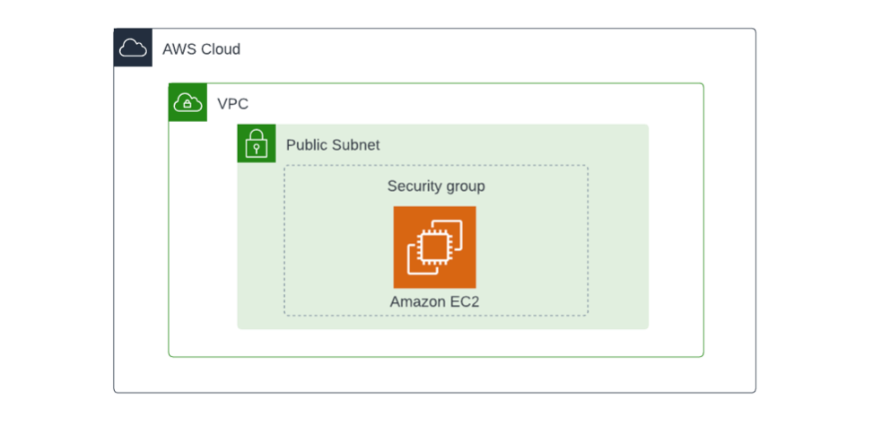

# Connect with AWS

You don't need to use SSH exclusively.

## How to Use

All examples are covered with `example-x` and `clean-x` Makefile targets. Based on that, in any case, the usage of:

```bash
make example-1
make clean-1
```

will set up all needed components and return important information.

**Warning**

Example no. 2 contains an `ansible.ini` file for demo purposes. If you want to use it, please use:

```bash
make generate-ssh-config
```

This command will generate dedicated ssh config file in `~/.ssh/config.d/ths`.

Additionaly, **please** change all references to `~/.ssh/id_ed2219_ths` as it's
my personal key.

You can generate new with command:
```bash
ssh-keygen -t ed25519 -C "training" -f /home/user/.ssh/id_ed2219_ths
```
## Architecture

### example 1



Video: [YouTube](https://www.youtube.com/watch?v=xM3bx6JLnuE)

```bash
ssh ec2-user@<OutputValue> -i /path/to/key  
```

### example 2


Video: [YouTube](https://www.youtube.com/watch?v=G9dQEqAFABE)

```bash
ssh THSInstance
ssh THSBastion
```

For Ansible test run:

```bash
ansible -i ansible.ini all -m ping
```

### example 3


Video: [YouTube](https://www.youtube.com/watch?v=Nf5XId-Zpas)

```bash
aws ssm start-session --target <OutputValue>
```

### example 4


Video: [YouTube](https://www.youtube.com/watch?v=0J6R1FtFeME)

```bash
aws ec2-instance-connect ssh --instance-id <OutputValue>
```

